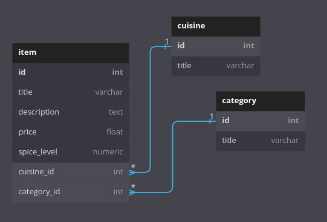

# Backend Bistro Pseudocode

For this project, we will be creating a simple Python/Django API to serve as the backend for our previously created React Restaurant frontend app. 

Create the models, views, and database for an API that provides READ operations for a user’s restaurant items in a PostgresQL database.

---

## Requirements

1. Store the following data in your PostgreSQL database and implement models for READ only operations for the following data:
    - Menu Items
        - Title
        - Description
        - Price
        - Spicy Level
        - FK to Category
        - FK to Cuisine
    - Category (Appetizer, Dessert, Main Dish, etc.)
    - Cuisine (American, Thai, etc.)

 

1. Create views to send JSON data back to a GET request for a list of all menu items with the category and cuisine labels nested in the data.

1. Create routes to use the views created in the previous step.
            
1. Change the URL in the React Restaurant Code to the Gitpod url of your running backend code only. (NOTE: We shouldn’t be writing any React code for basic requirements)

- - - 

## Database Table Structure

##### items table many to one relationship to cuisine and category table

Django python framework will allow us to create models/classes that will handle and write sql to our databases. Using Postgres for our DB with python library psycopg2. Sql will be generated "handwaved" using Django.

Djando uses Models/ python classes that allow us to write db tables using python without writing out any sql. 

After a table(s) is generated/ migrated into our Postgres db, our project.

